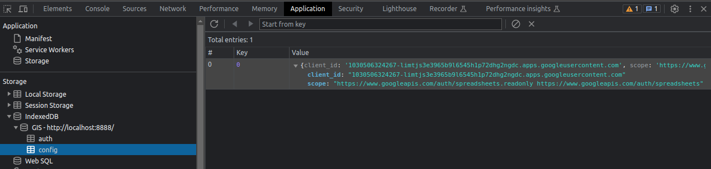
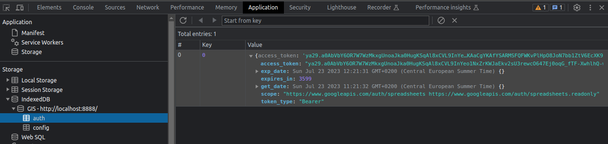
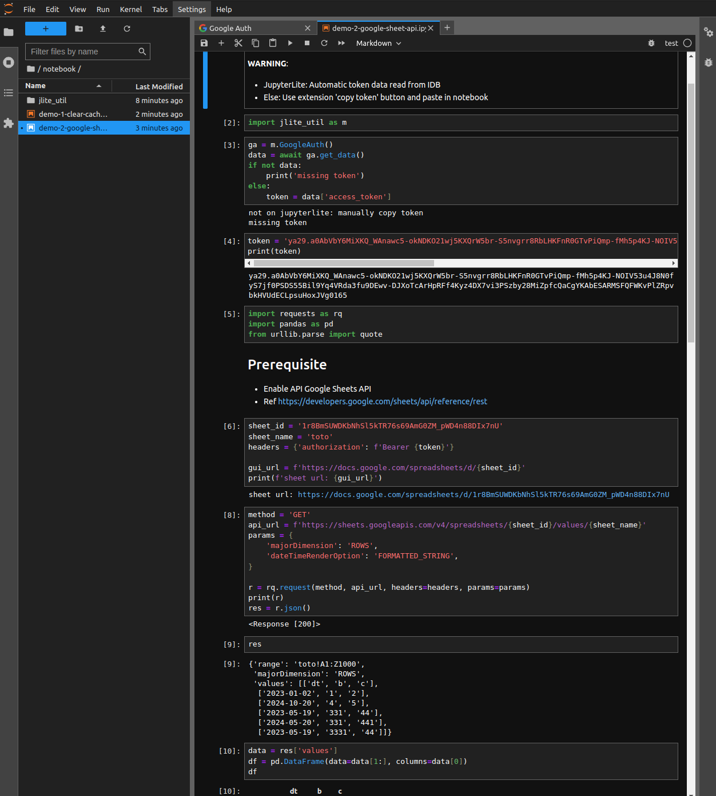

# JupyterLab Extension Example: React Auth Google Widget

[](https://jupyterlab-contrib.github.io/index.html)

This JupyterLab extension enables users to log in with Google Identity service for webapps and then use the token to interact with Google services.  
A notebook to read/write Google sheets is included.

## Overview

Main points:

- It is used to obtain an OAuth token from [Google Identity](https://developers.google.com/identity/gsi/web/guides/get-google-api-clientid) and use it to interact with its services, like Google [Sheets](https://developers.google.com/sheets/api/guides/concepts), [Drive](https://developers.google.com/drive/api/guides/about-sdk), etc.

- This extension is **NOT official**. It is an individual initiative and will be maintained on a best effort basis.

- It was build as a copy/paste/modify (as of jul23) from the official [React template](https://github.com/jupyterlab/extension-examples/tree/main/react-widget). It may be interesting as an example of a non trivial React widget.

- It shows how to use a JS lib available as a UMD bundle in the context of JupyterLab.

- It shows how to write to the browser [IndexedDB](https://developer.mozilla.org/en-US/docs/Web/API/IndexedDB_API) from the JS using lib [dexie.js](https://dexie.org/docs/). See demo notebook [demo-2-google-sheet-api.ipynb](./notebook/demo-2-google-sheet-api.ipynb) and associated [jlite_util](./notebook/jlite_util) small package.

- It is meant to be used primarily in [JupyterLite](https://github.com/jupyterlite/jupyterlite) as only a JupyterLite kernel can access the IndexedDB. However it can be used in JupyterLab. In this case use the 'Copy Token' button in the extension and paste to notebook. A Google token is valid for 1 hour so this is not really painful.

## Screenshots

Browser IndexDB stores:

- Google auth config:
  

- Google auth token data:
  

Actions:

- Usage video:
  [react-auth-google-get-token.webm](https://raw.githubusercontent.com/jupyterlab-contrib/react-auth-google-example/main/img/react-auth-google-get-token.webm)

- Use token from notebook to read/write a Google sheet (for example):
  [demo-2-google-sheet-api.ipynb](./notebook/demo-2-google-sheet-api.ipynb)
  

## Dev Install

Commands:

```sh
# from folder react-auth-google

# Required to deal with Yarn 3 workspace rules
touch yarn.lock

# install the extension in editable mode
python -m pip install -e .

# install your development version of the extension with JupyterLab
jupyter labextension develop . --overwrite

# build the TypeScript source once
jlpm build

# first terminal
# build the TypeScript source in watch mode
jlpm watch

# second terminal
# start JupyterLab in watch mode
jupyter lab --no-browser --watch

```

## Install

```bash
jlpm
jlpm build
jupyter labextension install .

# Rebuild Typescript source after making changes
jlpm build
# Rebuild JupyterLab after making any changes
jupyter lab build
```

You can watch the source directory and run JupyterLab in watch mode to watch for changes in the extension's source and automatically rebuild the extension and application.

```bash
# Watch the source directory in another terminal tab
jlpm watch
# Run jupyterlab in watch mode in one terminal tab
jupyter lab --watch
```
